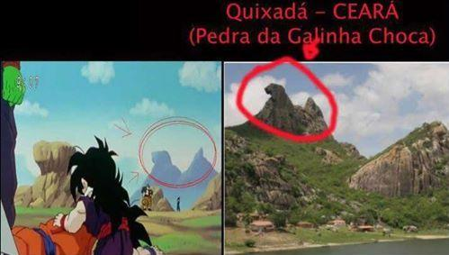
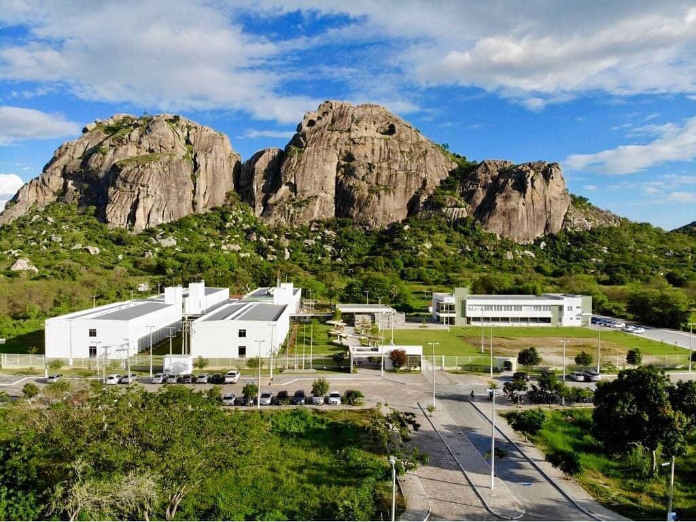
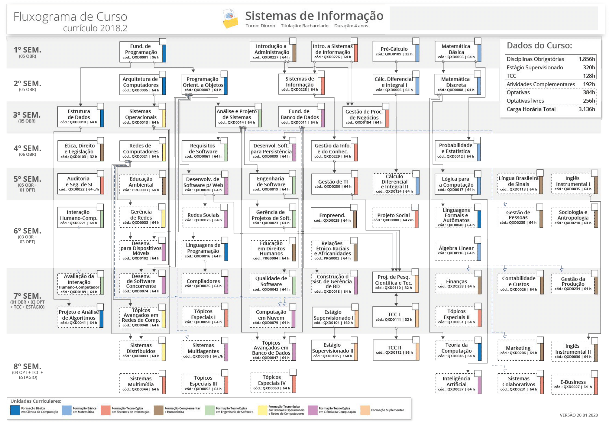

# Manual do Calouro

## Boas-vindas

## Quixadá

Quixadá é uma cidade localizada no sertão Central do Estado do Ceará. Conhecida como "Terra da Galinha Choca", "Terra dos Monólitos" ou "Cidade Rainha do Sertão". O principal ponto turístico da cidade é o Açude Cedro e a Pedra da Galinha Choca.

## Hollywood Sertaneja

A cidade de Quixadá já foi cenário de vários filmes do cinema nacional:

* A morte comando o cangaço (1960)
* O cangaceiro Trapalhão (1983) 
* O Quinze de Rachel de Queiroz (2004)
* O Auto da Camisinha (2009) 
* Área Q (2011)
* Cine Holliúdy (2013)
* A Lenda do Gato Preto (2015)
* O Shaolin do Sertão (2016)

A cidade de Quixadá já apareceu até no desenho Dragon Ball Z.

## Cidade Universitária

A cidade possui 6 instituições com ensino superior e técnico: 
* Faculdade de Educação, Ciências e Letras do Sertão Central (Unidade acadêmica da UECE).
* Centro Universitário Católica de Quixadá.
* Universidade Federal do Ceará.
* Universidade Estadual Vale do Acaraú.
* Instituto Educacional Superior e Tecnológico Faculdade Cisne.
* Instituto Federal de Educação, Ciência e Tecnologia do Ceará.

## Campus de Quixadá

O Campus de Quixadá iniciou suas atividades eme 2007 com o curso de Bacharelado em Sistemas de Informação. Atualmente, o campus de Quixadá tem os seguintes cursos:

* Bacharelado em Sistemas de Informação (2007)
* Bacharelado Engenharia de Software (2010)
* Tecnólogico em Redes de Computadores (2010)
* Bacharelado em Ciência da Computação (2013)
* Bacharelado em Engenharia da Computação (2015)
* Bacharelado em Design Digital (2015)
* Mestrado Acadêmico (2019)

## Disciplinas

Na UFC, cada período letivo corresponde a 16 semanas, assim cada crédito corresponde a 16 horas-aulas (1 crédito = 16h). Por exemplo, se a disciplina vale 4 créditos então você vai ter 4 horas-aulas por semana dessa disciplina e a carga horária total será de 64 horas-aulas. O curso de Sistemas de Informação tem uma carga horária mínima de 3136 (não se preocupe passa rápido). No primeiro semestre, as disciplinas são:

* **Fundamentos de Programação** (6 créditos)
* **Pré-cálculo** (2 créditos)
* **Matemática Básica** (4 créditos)
* **Introdução a Sistemas de Informação** (4 créditos)
* **Introdução a Administração** (4 créditos)

* **Teoria Geral da Administração** (4 créditos) 

A estrutura curricular do curso de SI é a seguinte:

Observe que tem algumas setas saindo de uma disciplina origem para um disciplina destino. Isso significa que a disciplina origem é um pré-requisito para a disciplina destino. Por exemplo, Fundamentos de Programação é um pré-requisito para Estrutura de Dados e Programação Orientada a Objetos.

## Bolsas

A UFC desenvolve várias políticas para incentivar, acompanhar e promover o desenvolvimento do seus estudantes durante toda a sua trajetória acadêmica utilizando programas de bolsas e auxílios.

* **Auxílio Moradia**
O Programa Auxílio Moradia tem por objetivo viabilizar a permanência de estudantes matriculados nos Cursos de Graduação dos Campi da Universidade Federal do Ceará (UFC) em Crateús, Quixadá, Russas e Sobral em comprovada situação de vulnerabilidade econômica, assegurando-lhes auxílio institucional para complementação de despesas com moradia e alimentação durante todo o período do curso ou enquanto persistir a mesma situação.

Fonte: https://prae.ufc.br/pt/auxilio-moradia/

* **Bolsa do Iniciação Acadêmica (BIA)**
O Programa Bolsa de Iniciação Acadêmica tem por objetivo propiciar aos estudantes de Cursos de Graduação Presenciais da Universidade Federal do Ceará (UFC) – em situação de vulnerabilidade sócio-econômica comprovada – especialmente os de semestres iniciais, condições financeiras para sua permanência e desempenho acadêmico satisfatório, mediante atuação, em caráter de iniciação acadêmica, nas diversas unidades da Instituição.
Fonte: https://prae.ufc.br/pt/bolsa-de-iniciacao-academica/

* **Bolsa do Programa de Iniciação à Docência**
O Programa de Iniciação à Docência (PID) é desenvolvido em duas modalidades: monitoria remunerada e monitoria voluntária. Na primeira, o monitor recebe uma bolsa-auxílio para desempenhar as funções e, por isso, não deve participar de qualquer outra atividade remunerada, seja pública ou privada. Na segunda, o monitor desempenha as atividades de maneira voluntária, sem o recebimento do auxílio.
Fonte: https://prograd.ufc.br/pt/bolsas/bolsas-do-pid-programa-de-iniciacao-a-docencia/

* **Bolsa do Programa de Acolhimento e Incentivo a Permanência**
A Bolsa de Apoio a Projetos da Graduação tem como finalidade promover a articulação, o acompanhamento e a avaliação de ações acadêmicas, bem como ampliar as iniciativas de atividades alternativas e inovadoras de ensino que contribuam para a redução de fatores determinantes para a reprovação e evasão dos estudantes, como parte da política de acolhimento e incentivo à permanência dos alunos nos cursos de graduação da UFC.
Fonte: https://prograd.ufc.br/pt/bolsas/bolsas-de-apoio-a-projetos-de-graduacao/

* **Bolsa do Programa de Extensão**
O Programa de Extensão Universitária destina bolsa de extensão, como auxílio financeiro, ao(à) estudante de graduação vinculado(a) a um Programa ou a um Projeto de Extensão, orientado(a) e acompanhado(a) por um professor(a) ou técnico(a) com nível superior, vinculado ao quadro ativo permanente da UFC
Fonte: https://prex.ufc.br/pt/bolsas/

* **Bolsa do Programa de Educação Tutorial**
Cada grupo do PET-UFC estrutura-se em um professor tutor, um professor cotutor, e máximo de doze estudantes bolsistas e seis voluntários. Cabe aos bolsistas zelar pela qualidade acadêmica do programa, participar e apresentar excelente rendimento em todas as atividades programadas pelo professor-tutor, além de publicar ou apresentar um trabalho científico por ano (em grupo ou individualmente) e fazer referência à sua condição de bolsista do PET nos trabalhos publicados e apresentados.
Fonte: https://prograd.ufc.br/pt/bolsas/bolsas-do-pet-ufc-programa-de-educacao-tutorial-universidade-federal-do-ceara/

## Programa de Educação Tutorial

O **Programa de Educação Tutorial** (PET), é formado por um grupo de estudantes com o auxílio de um tutor, com o objetivo de desenvolver projetos seguindo os 3 pilares bases da universidade: pesquisa, extensão e ensino. Mas o que isso significa na prática? Somos um grupo com o objetivo de agregar valor para a comunidade, seja ela acadêmica ou não, através de projetos que são desenvolvidos e ofertados para suprir alguma necessidade. 

O curso de Sistemas de Informação (SI) possui um grupo PET, que é composto somente por discentes do curso. O grupo é formado por alunos de diferentes semestres o que possibilita um maior engajamento entre o curso contribuindo com um aumento da diversidade de opinião, visto que cada aluno contribui com a sua visão e experiências únicas, tanto passadas quanto as que estão vivenciando no semestre. Além disso, é um local de trocas de experiências entre os próprios membros, o que aumenta o conhecimento dos alunos e possibilita um maior desenvolvimento pessoal e profissional.

**Projetos**

Segue abaixo uma descrição resumida de alguns projetos:

* **Workshop de Tecnologia da Informação do Sertão Central (WTISC)** 
O WTISC é um evento realizado anualmente na UFC Campus Quixadá e tem como objetivo criar oportunidades de aprendizagem, promover e difundir conhecimentos sobre as diversas áreas de Tecnologia da Informação orientadas à comunidade, de forma a fortalecer e motivar a formação técnico-profissional, através da abordagem de temas contemporâneos e da troca de experiências entre profissionais e acadêmicos.
Programação do último [WTISC 2020](https://petufc.github.io/wtisc-2020/palestras)

* **Acompanhamento de Calouros**
Com o intuito de auxiliar os novos ingressantes do curso, o grupo PET-SI criou o projeto de acompanhamento de calouros. Liderados por 2 membros bolsistas, os grupos têm como objetivo compartilhar experiências entre os alunos, que vão desde sanar dúvidas que venham a surgir sobre a universidade em si como também em relação às disciplinas do curso. Também é uma forma de aproximar os diferentes integrantes do curso e criar um elo entre o PET e possíveis integrantes.

* **Letramento Digital**
Apesar de vivermos na Era Digital, nem todas as pessoas apresentam conhecimentos com essas ferramentas e o Letramento Digital surgiu com o objetivo de levar esse conhecimento às pessoas que não tem acesso a essas tecnologias e que possuem nenhum, ou pouco, conhecimento com as tecnologias atuais. Aqui apresentamos coisas básicas relacionadas à informática básica, difundindo assim o conhecimento sobre as Tecnologias de Informação.

Vale ressaltar que os projetos geram carga horária complementar para os cursos.

Nossas redes sociais:

* Instagram​ : https://www.instagram.com/petsi.ufc/
* Facebook​ : ​ https://www.facebook.com/petsiufc/
* Youtube​ : ​ https://www.youtube.com/user/PETSIUFC
* Linkedin​ : ​ https://www.linkedin.com/in/pet-si-2920571ab/

## Atividade complementares

Objetivando a formação de profissionais qualificados, as atividades complementares proporcionam ao aluno oportunidades para auxilia-lo no desenvolvimento pessoal, social e de competências necessárias no mercado de trabalho, tais como perfil empreendedor, iniciativa, liderança, autoconhecimento, perseverança e habilidade em lidar com obstáculos, mudanças e transformações, além de prestar serviços a comunidade.

Para o curso de SI são necessárias 192h de atividades, que podem ser divididas e administradas em algumas categorias, como atividades artístico-culturais e esportivas, atividades de participação e/ou organização de eventos, experiências ligadas à formação profissional, produção Técnica e/ou Científica, dentre outras.

**Alguns exemplos de atividades proporcionadas pela UFC são:**

 - Game Night
 - Oficinas/minicursos do WTISC
 - Oficinas/minicursos dos Encontros Universitários
 - Palestras do WTISC – Workshop de TI do Sertão Central
 - Participação Regular em Célula de Aprendizagem Cooperativa, coordenada por bolsistas da aprendizagem cooperativa.
 - Entre outras atividades, como palestras, eventos e grupos diversos.
**Mais informações: https://si.quixada.ufc.br/ac/**

## Sistemas UFC

 - SIPPA (Sistema de Presenças e Planos de Aula): 
Sistema próprio do campus de Quixadá utilizado para computar presenças, solicitar avaliações e verificar o desenvolvimento nas disciplinas.
LINK: https://academico.quixada.ufc.br/sippa

 - SIGAA (Sistema Integrado de Gestão de Atividades Acadêmicas):
Sistema utilizado para diversos fins, como emição de documentos e declarações, consultas do discente, consultas do curso, calendário acadêmico, matricula online, supressão de matricula, dentre outros serviços.
LINK: https://si3.ufc.br/sigaa

 - SISAC (Sistema de Atividades Complementares):
Sistema utilizado para listagem e somatorio das atividades complementares realizadas.
LINK: https://academico.quixada.ufc.br/sisac

 - Moodle (Plataforma de aprendizagem à distância): 
Bastante utilizado pelos professores tanto de forma remota como presencial, esta plataforma disponibiliza um local para realização de atividades, avaliações e comunicação entre alunos e professores das disciplinas cursadas durante o semestre.
LINK: https://moodle2.quixada.ufc.br

**Outros sistemas: https://sistemas.quixada.ufc.br**
